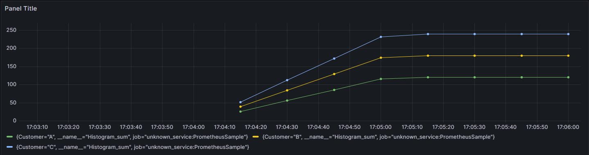
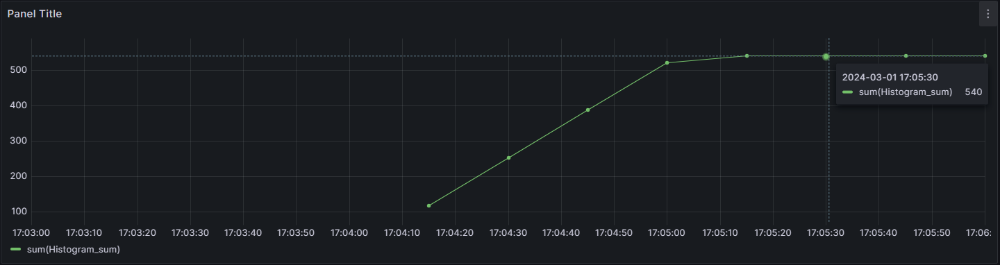
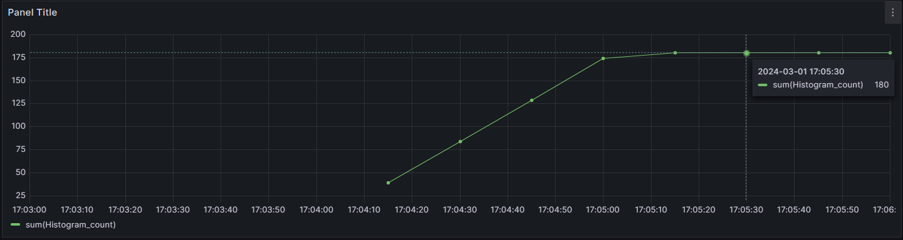
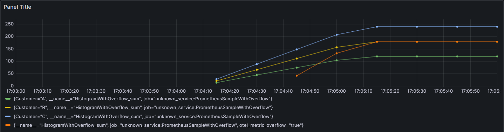
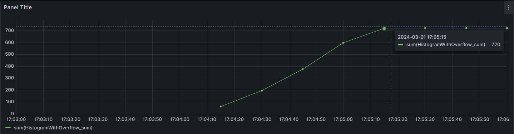
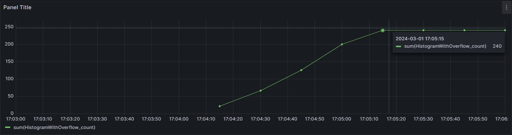

# How to use MetricOverflowAttribute?

This doc would cover how one can use the overflow attribute to derive information about any dropped metrics. We would use the below mentioned scenario to compare the difference in the user experience when consuming metrics.

## Scenario details:

- A user application emits a histogram to track some metric for their customers
- The user has configured the SDK cardinality limit to `3`
- In total, there are `5` unique tag combinations that are emitted by the application within the duration of `1` minute:

    - Following measurements for customers A, B, and C are emitted every `1` second for the entire `1` minute duration

        | Metric Value | Dimensions   |
        |:------------:|:------------:|
        |2             | Customer: A  |
        |3             | Customer: B  |
        |4             | Customer: C  |

    - Following measurements for customers D and E are only emitted every `1` second but ONLY in the last `30` seconds

        | Metric Value | Dimensions   |
        |:------------:|:------------:|
        |1             | Customer: D  |
        |5             | Customer: E  |

## Expected summaries for this scenario

Since the measurements are recorded every `1` second:
- Measurements for Customers A, B, and C are recorded `60` times in `1` minute
- Measurements for Customers D and E are recorded `30` times in `1` minute

| Dimensions   |  Recorded Sum |
|:------------:|:-------------:|
|Customer: A   |  2 * 60 = 120 |
|Customer: B   |  3 * 60 = 180 |
|Customer: C   |  4 * 60 = 240 |
|Customer: D   |  1 * 30 = 30  |
|Customer: E   |  5 * 30 = 150 |

| Aggregation Type | Value (aggregated across all dimensions)|
|:----------------:|:---------------------------------------:|
|Sum               | 120+180+240+30+150 = 720                |
|Count             | 60+60+60+30+30 = 240                    |

## Run the scenario

Prerequisites: You already have Prometheus and Grafana setup to collect metrics from the application.

The application uses OTLP Exporter to send data to Prometheus. We then use Grafana to consume these metrics.

First, let's run the scenario without making use of the overflow attribute. The code for this is contained in [WithoutOverflowAttribute](./src/WithoutOverflowAttribute//Program.cs) project.

Let's check how the metrics show up on Grafana for this run:

### Sum by Customer ID

Sum data is shown for customers A, B, and C only.

### Total Sum across all Customer IDs

The total sum reported is `540` as we can summarize the sum data for customers A, B, and C only.

### Total Count across all Customer IDs

The total count reported is `180` as we can summarize the count data for customers A, B, and C only.

> We have lost all information about customers D and E because the SDK is configured with cardinality limit of `3`, so it only keeps track of the first three unique dimension combinations that it encounters. Any measurements with newer unique dimensions are entirely dropped.

## How can the overflow attribute help?

Now, let's run the scenario while using the overflow attribute. The code for this is contained in [WithOverflowAttribute](./src/WithOverflowAttribute/Program.cs) project.

Let's check how the metrics show up on Grafana for this run:

### Sum by Customer ID

Sum data is shown for customers A, B, and C.

In addition to this, we see the aggregated sum data for customers D and E represented by the dimension combination `otel_metric_overflow="true"`.

> [!NOTE]
> Measurements for customers D and E were only emitted in the second half of the `1` minute duration. That's why you see the delay in data reported for `otel_metric_overflow="true"`

### Total Sum across all Customer IDs

The total sum reported is `720` which matches the [expected total sum](#expected-summaries-for-this-scenario) as we can now summarize the sum data for all the customers.

### Total Count across all Customer IDs

The total sum reported is `240` which matches the [expected total count](#expected-summaries-for-this-scenario) as we can now summarize the sum data for all the customers.

## Closing remarks

The above scenario showcases how users can utilize the overflow attribute to calculate true summaries for their metrics when aggregated across all the dimension combinations.

#### Corollary

The higher the difference between the true summary and the summary of the reported dimensions, the more is the amount of data loss for that metric.

For example, in this case:
- The true sum is `720` and sum of the reported dimensions is `540`. The difference between these two values is `180`
- Similarly the difference for count is `60`.

This implies that the SDK lost a total of `60` measurements that amounted to a value of `180`. This trait extends to `Min` and `Max` summaries as well. Put together, these stats can provide useful information in deciding the quality of metrics collection and thereby help the user realize the configuration/instrumentation changes needed to address the situation.